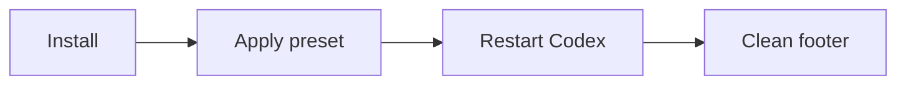

# Codex HUD

**Version:** v0.2.0 · **Plugin:** `codex-hud` · **Default:** `balanced`


[3-second demo](assets/codex-hud-demo.mp4)

Native Codex footer preset. See model, context, limits, permission mode, git, worktree, and progress without extra commands.



## Install

```bash
codex plugin marketplace add ir272/codex-hud
codex plugin add codex-hud@codex-hud
```

Then ask Codex:

```text
Use codex-hud to apply the footer.
```

## Presets

- `compact`: small terminals
- `balanced`: best default
- `full`: maximum detail

## Useful commands

```text
Use codex-hud to check my setup.
Use codex-hud to apply the compact preset.
Use codex-hud to apply the full preset.
```

Pin:

```bash
codex plugin marketplace add ir272/codex-hud --ref v0.2.0
```

No custom bars yet; Codex must expose a native renderer first.
